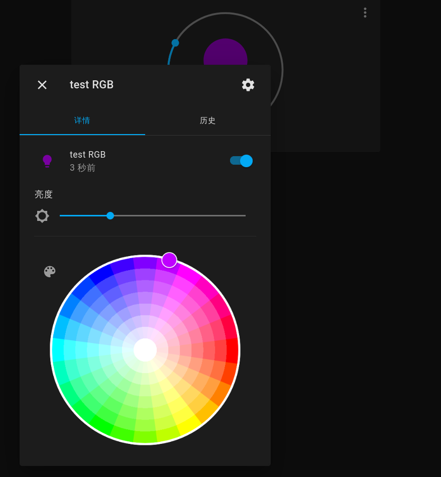
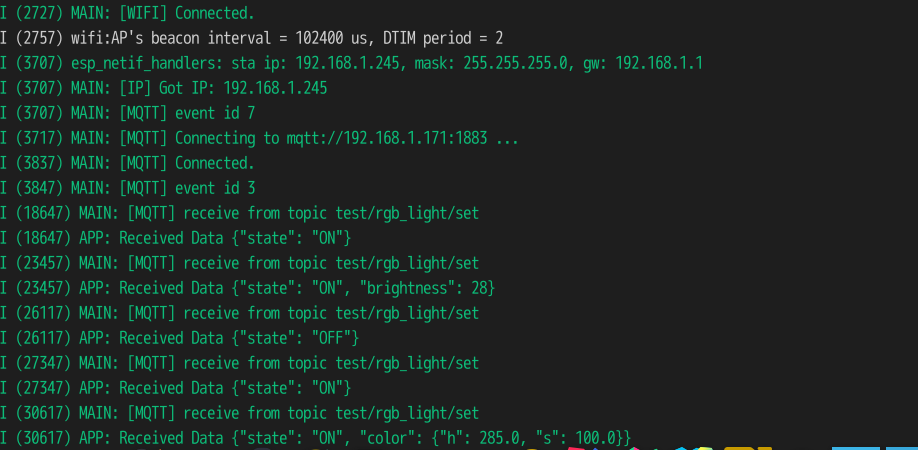

# ESP32S2 MQTT RGB Light

One great step for a smart home.

A test prototype for a whole smart home solution with [Home-assistant](https://github.com/home-assistant/core) and [emqx](https://github.com/emqx/emqx).

## TODO

- [ ] Low power

## Home assistant configuration

```yaml
light:
  - platform: mqtt
    name: "test RGB"
    schema: json
    state_topic: "test/rgb_light"
    command_topic: "test/rgb_light/set"
    brightness: true
    brightness_scale: 100
    color_mode: true
    supported_color_modes: ["hs"]
```

## Screenshots




